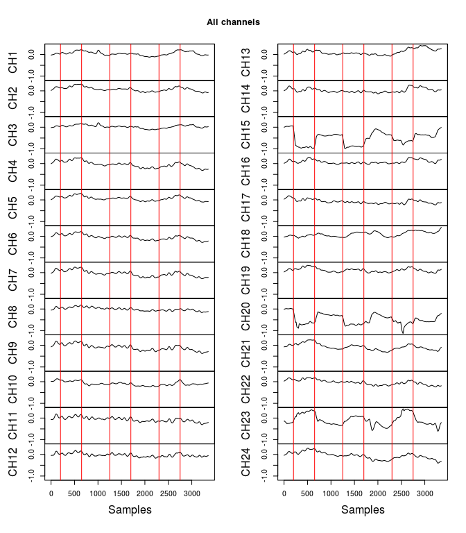
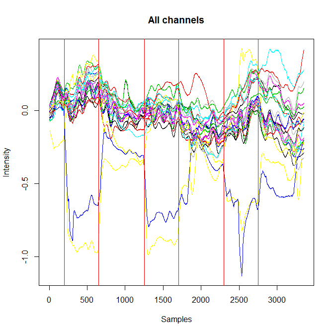
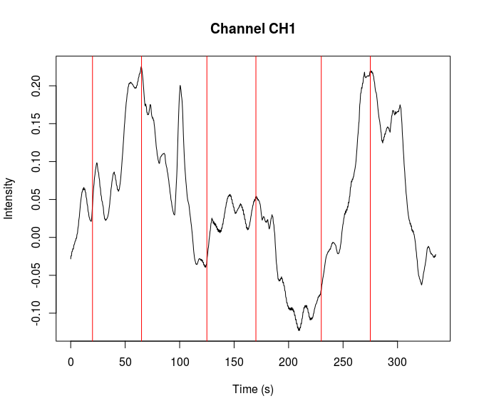
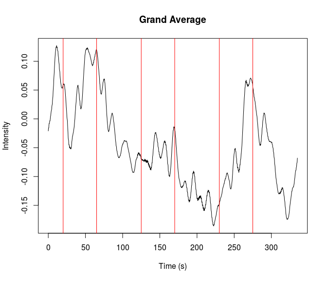
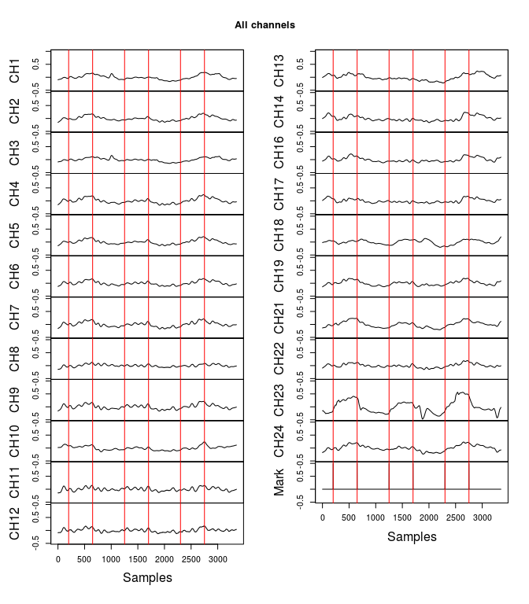
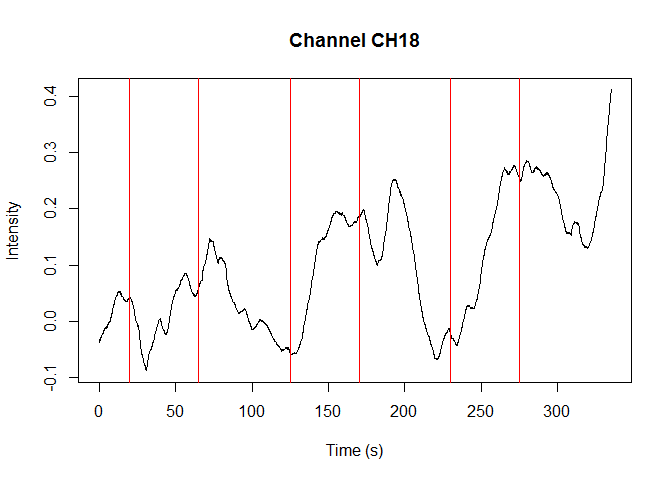
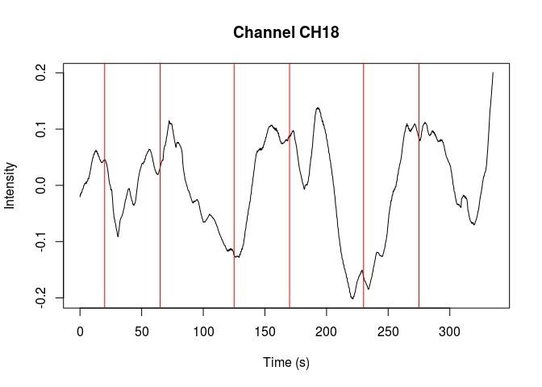
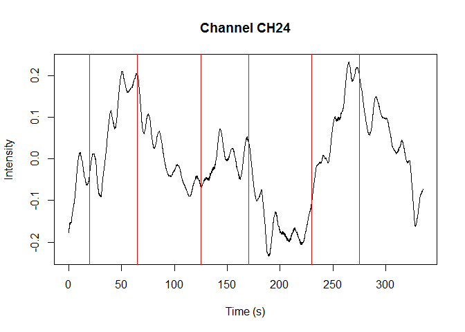
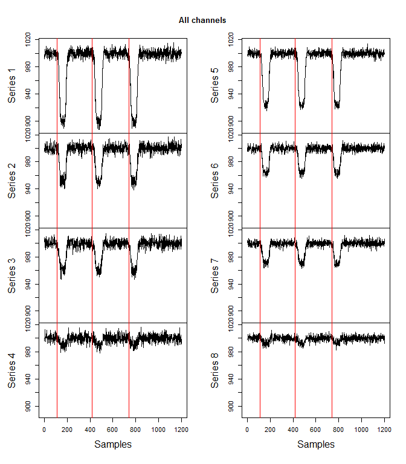

<!-- README.md is generated from README.Rmd. Please edit that file -->
fnirsr
======

[](https://travis-ci.org/erzk/fnirsr) [](https://codecov.io/github/erzk/fnirsr?branch=master)

**An R Package for analysing functional near-infrared spectroscopy (fNIRS) data**

Installation
------------

-   Install *devtools* if you don’t have it yet: `install.packages("devtools")`
-   Use `devtools::install_github("erzk/fnirsr")` to install the package.

Sample data files come from [NIRS-SPM](https://www.nitrc.org/projects/nirs_spm/) and [HOMER2](http://homer-fnirs.org/).

Usage
-----

Loading a file (ETG-4000)
-------------------------

In its current development stage this package can only read raw csv files produced by Hitachi ETG-4000. Other systems produce file with a different structure and so far I did not need to use them. Eventually, I might expand this package to work with other file types.

File *Hitachi\_ETG4000\_24Ch\_Total.csv* , which is used in this vignette and is attached to this package, comes from [NIRS-SPM](http://bispl.weebly.com/nirs-spm.html#/).

Top level information about the recording is held in a header. It has an irregular form so it is a bit tricky to parse. This package version reads the section of the csv file before the data section and returns a vector with header info:

``` r
library(fnirsr)

file_path <- system.file("extdata", "Hitachi_ETG4000_24Ch_Total.csv", package = "fnirsr")
header <- load_ETG4000_header(file_path)

head(header)
#> [[1]]
#> [1] "File Version,1.08"
#> 
#> [[2]]
#> [1] "Patient Information"
#> 
#> [[3]]
#> [1] "ID,KikuchiWF"
#> 
#> [[4]]
#> [1] "Name,Kikuchi"
#> 
#> [[5]]
#> [1] "Comment,IOWA fukawa-late,,"
#> 
#> [[6]]
#> [1] "Age, 44y"
```

Loading the signal from csv files can be accomplished using the basic `load_ETG4000_data()` function. It reads the data section of a csv file, changes the `Time` column to reflect time period from the beginning of the recording (instead of actual hour), and returns a data frame. Header of the ETG-4000 file needs to be provided as it includes the information about the sampling period.

``` r
df <- load_ETG4000_data(file_path, header)

str(df)
#> 'data.frame':    3351 obs. of  30 variables:
#>  $ Probe1.Total.: int  1 2 3 4 5 6 7 8 9 10 ...
#>  $ CH1          : num  -0.0284 -0.0264 -0.0251 -0.0244 -0.0241 ...
#>  $ CH2          : num  0.0174 0.0198 0.0221 0.0238 0.025 ...
#>  $ CH3          : num  -0.0217 -0.0199 -0.0189 -0.0184 -0.0182 ...
#>  $ CH4          : num  -0.008498 -0.005906 -0.003531 -0.001651 -0.000384 ...
#>  $ CH5          : num  0.00966 0.01212 0.01442 0.01579 0.01667 ...
#>  $ CH6          : num  -0.0194 -0.0176 -0.0158 -0.0146 -0.0138 ...
#>  $ CH7          : num  -0.0292 -0.0267 -0.0247 -0.0237 -0.0231 ...
#>  $ CH8          : num  -0.0513 -0.0493 -0.0488 -0.05 -0.05 ...
#>  $ CH9          : num  -0.0716 -0.0686 -0.066 -0.0635 -0.0636 ...
#>  $ CH10         : num  0.0131 0.0149 0.0155 0.0154 0.0148 ...
#>  $ CH11         : num  -0.0708 -0.0695 -0.0675 -0.0662 -0.0681 ...
#>  $ CH12         : num  -0.0458 -0.0469 -0.0472 -0.0493 -0.0485 ...
#>  $ CH13         : num  0.0151 0.0177 0.0178 0.0186 0.0196 ...
#>  $ CH14         : num  0.00488 0.00832 0.01059 0.01139 0.01237 ...
#>  $ CH15         : num  -0.00092 -0.000109 0.001794 0.004157 0.005974 ...
#>  $ CH16         : num  0.0128 0.0147 0.0165 0.0177 0.0183 ...
#>  $ CH17         : num  0.0327 0.0352 0.0372 0.039 0.0403 ...
#>  $ CH18         : num  -0.0378 -0.0358 -0.0348 -0.0335 -0.0326 ...
#>  $ CH19         : num  0.0289 0.0318 0.0345 0.0361 0.0375 ...
#>  $ CH20         : num  -0.01041 -0.00884 -0.00789 -0.00707 -0.00677 ...
#>  $ CH21         : num  -0.0736 -0.0714 -0.0697 -0.0687 -0.0682 ...
#>  $ CH22         : num  0.0229 0.0264 0.0291 0.0311 0.0322 ...
#>  $ CH23         : num  -0.145 -0.144 -0.143 -0.142 -0.141 ...
#>  $ CH24         : num  -0.0446 -0.0412 -0.038 -0.0359 -0.0353 ...
#>  $ Mark         : int  0 0 0 0 0 0 0 0 0 0 ...
#>  $ Time         : num  0 0.1 0.2 0.3 0.4 0.5 0.6 0.7 0.8 0.9 ...
#>  $ BodyMovement : int  0 0 0 0 0 0 0 0 0 0 ...
#>  $ RemovalMark  : int  0 0 0 0 0 0 0 0 0 0 ...
#>  $ PreScan      : int  0 0 0 0 0 0 0 0 0 0 ...
```

Plotting a signal (ETG-4000)
----------------------------

Once the csv file is loaded and a data frame is created, you can start plotting the signal.

Plotting function `plot_ETG4000()` comes with four arguments:

-   `facets`
-   `overlap`
-   `channel`
-   `average`

The default choice is `facets` which will show all channels in separate facets. This should enable spotting outliers.

``` r
plot_ETG4000(df)
```



Another option is plotting all channels overlapping each other:

``` r
plot_ETG4000(df, type = "overlap")
```



Alternatively, if you want to plot a single channel of interest then use the `separate` argument and a channel number. This option uses time column as an x-axis (as opposed to the previous plots using samples).

``` r
plot_ETG4000(df, type = "separate", channel = 1)
```



In order to create a plot showing averaged signal, it is necessary to first create a column with the averaged signal:

``` r
df <- grand_average_ETG4000(df)

names(df)
#>  [1] "Probe1.Total." "CH1"           "CH2"           "CH3"          
#>  [5] "CH4"           "CH5"           "CH6"           "CH7"          
#>  [9] "CH8"           "CH9"           "CH10"          "CH11"         
#> [13] "CH12"          "CH13"          "CH14"          "CH15"         
#> [17] "CH16"          "CH17"          "CH18"          "CH19"         
#> [21] "CH20"          "CH21"          "CH22"          "CH23"         
#> [25] "CH24"          "Mark"          "Time"          "BodyMovement" 
#> [29] "RemovalMark"   "PreScan"       "GrandAverage"
```

Once `GrandAverage` column is created, the plot for averaged channels can be created:

``` r
plot_ETG4000(df, type = "average")
```



Cleaning a signal (ETG-4000)
----------------------------

If a channel (or several channels) is corrupt and cannot be cleaned then the simplest way to obtain clean grand average is to remove the noisy channel.

The faceted plots above show that channel 15 and 20 look noisy. To remove these channels from the signal data frame use the following:

``` r
df <- remove_channels_ETG4000(df, channel = c(15, 20))

names(df)
#>  [1] "Probe1.Total." "CH1"           "CH2"           "CH3"          
#>  [5] "CH4"           "CH5"           "CH6"           "CH7"          
#>  [9] "CH8"           "CH9"           "CH10"          "CH11"         
#> [13] "CH12"          "CH13"          "CH14"          "CH16"         
#> [17] "CH17"          "CH18"          "CH19"          "CH21"         
#> [21] "CH22"          "CH23"          "CH24"          "Mark"         
#> [25] "Time"          "BodyMovement"  "RemovalMark"   "PreScan"      
#> [29] "GrandAverage"
```

Detrending a signal (ETG-4000)
------------------------------

fNIRS signal is likely to show a linear trend which can be removed.

Grand Average in the plot above is showing a linear downward trend. The linear trend can be removed from all channels (recommended) or from a single channel.

``` r
fnirs_detrended <- detrend_ETG4000_data(df) # detrend all channels
plot_ETG4000(fnirs_detrended)
```



I suggest detrending the signal before creating a Grand Average. This way the `grand_average_ETG4000()` function will create a *Grand Average* column with detrended signal.

The effect of detrending is easier to observe when zooming on a particular channel. Compare the plots underneath to see how removing the linear trend is changing the signal:

``` r
plot_ETG4000(df, "separate", 18) # zoom on one channel to notice detrending
```



Here is the same channel but without the linear trend:

``` r
plot_ETG4000(fnirs_detrended, "separate", 18)
```



It is also possible to detrend the signal of only one channel:

``` r
# plot of the original channel before detrending
plot_ETG4000(df, "separate", 24)
```


Here is that channel after detrending. Other channels are not changed.

``` r
# detrend only one channel - 24
fnirs_det_24 <- detrend_ETG4000_data(df, "single", 24)
# plot of the same channel after detrending
plot_ETG4000(fnirs_det_24, "separate", 24)
```



Loading a file (.nirs)
----------------------

While working with fNIRS data you might come across other file formats. One of the most popular formats is *.nirs* which is used by [HOMER2](http://homer-fnirs.org/). This package’s main goal is to help in analysing ETG-4000 data but I happened to write simple .nirs functions.

To load .nirs data use the following code:

``` r
file_path_nirs <- system.file("extdata", "Simple_Probe.nirs", package = "fnirsr")
nirs_file <- load_nirs_data(file_path_nirs)
```

This will load a list with data and additional information. You can explore it in the following way:

``` r
str(nirs_file)
#> List of 6
#>  $ SD      :List of 14
#>   ..$ : num [1, 1:2] 830 690
#>   ..$ : num [1, 1:3] 2 2 0
#>   ..$ : num [1, 1] 1
#>   ..$ : num [1:4, 1:3] 0 4 0 4 0 0 4 4 0 0 ...
#>   ..$ : num [1:4, 1] 1 1 1 1
#>   ..$ : num [1:8, 1:4] 1 1 1 1 1 1 1 1 1 2 ...
#>   ..$ : num [1, 1] -1.41
#>   ..$ : num [1, 1] 5.41
#>   ..$ : num [1, 1] -1.41
#>   ..$ : num [1, 1] 5.41
#>   ..$ : num [1, 1] 1
#>   ..$ : num [1, 1] 4
#>   ..$ : num [1:8, 1] 1 1 1 1 1 1 1 1
#>   ..$ : num [1:8, 1] 1 1 1 1 1 1 1 1
#>   ..- attr(*, "dim")= int [1:3] 14 1 1
#>   ..- attr(*, "dimnames")=List of 3
#>   .. ..$ : chr [1:14] "Lambda" "SrcPos" "SrcAmp" "DetPos" ...
#>   .. ..$ : NULL
#>   .. ..$ : NULL
#>  $ t       : num [1:1200, 1] 0.1 0.2 0.3 0.4 0.5 0.6 0.7 0.8 0.9 1 ...
#>  $ d       : num [1:1200, 1:8] 998 992 1001 1001 994 ...
#>  $ s       : num [1:1200, 1] 0 0 0 0 0 0 0 0 0 0 ...
#>  $ aux     : num [1:1200, 1] 0.0998 0.1987 0.2955 0.3894 0.4794 ...
#>  $ userdata:List of 4
#>   ..$ :List of 6
#>   .. ..$ :List of 1
#>   .. .. ..$ : num [1, 1] 10.9
#>   .. ..$ :List of 1
#>   .. .. ..$ : num [1, 1] 41.9
#>   .. ..$ :List of 1
#>   .. .. ..$ : num [1, 1] 73.9
#>   .. ..$ :List of 1
#>   .. .. ..$ : chr[0 , 1] 
#>   .. ..$ :List of 1
#>   .. .. ..$ : chr[0 , 1] 
#>   .. ..$ :List of 1
#>   .. .. ..$ : chr[0 , 1] 
#>   ..$ :List of 1
#>   .. ..$ :List of 1
#>   .. .. ..$ : chr [1, 1] "1"
#>   ..$ :List of 1
#>   .. ..$ :List of 1
#>   .. .. ..$ : num [1, 1] 100
#>   ..$ : int [1, 1] 1
#>   ..- attr(*, "dim")= int [1:3] 4 1 1
#>   ..- attr(*, "dimnames")=List of 3
#>   .. ..$ : chr [1:4] "data" "cnames" "cwidth" "ceditable"
#>   .. ..$ : NULL
#>   .. ..$ : NULL
#>  - attr(*, "header")=List of 3
#>   ..$ description: chr "MATLAB 5.0 MAT-file, Platform: PCWIN, Created on: Thu Nov 29 17:22:35 2012                                                  "
#>   ..$ version    : chr "5"
#>   ..$ endian     : chr "little"
```

The most interesting elements are `t` (time) and `d` (data):

``` r
# matrix dimensions
dim(nirs_file$d)
#> [1] 1200    8

# have a look at the data
head(nirs_file$d)
#>           [,1]      [,2]      [,3]      [,4]      [,5]      [,6]      [,7]
#> [1,]  997.8372  999.6360 1008.4674 1000.2929  997.8885 1001.0946 1004.6207
#> [2,]  991.6721  995.0285 1002.2865  995.4724  998.1526  995.3960 1003.1169
#> [3,] 1000.6267  996.2632 1005.3356 1004.4084  995.7794 1000.3139  998.5897
#> [4,] 1001.4384  999.8459  999.3621 1002.5955 1002.7388 1000.4492 1003.1521
#> [5,]  994.2676 1004.9418 1000.9402 1012.7494  997.5462 1007.1959 1001.8452
#> [6,] 1005.9546  997.0049  997.7337 1004.1946 1001.7077  995.2165  997.1212
#>           [,8]
#> [1,]  997.2000
#> [2,]  998.5318
#> [3,] 1000.1782
#> [4,] 1002.4467
#> [5,] 1005.7159
#> [6,] 1004.6705
```

Plotting a signal (.nirs)
-------------------------

Signals can be visualised in faceted time series plots. Red lines symbolise the events (triggers).

``` r
plot_nirs(nirs_file)
```



*Next releases will include filtering, splitting, and transforming the continuous recordings.*
